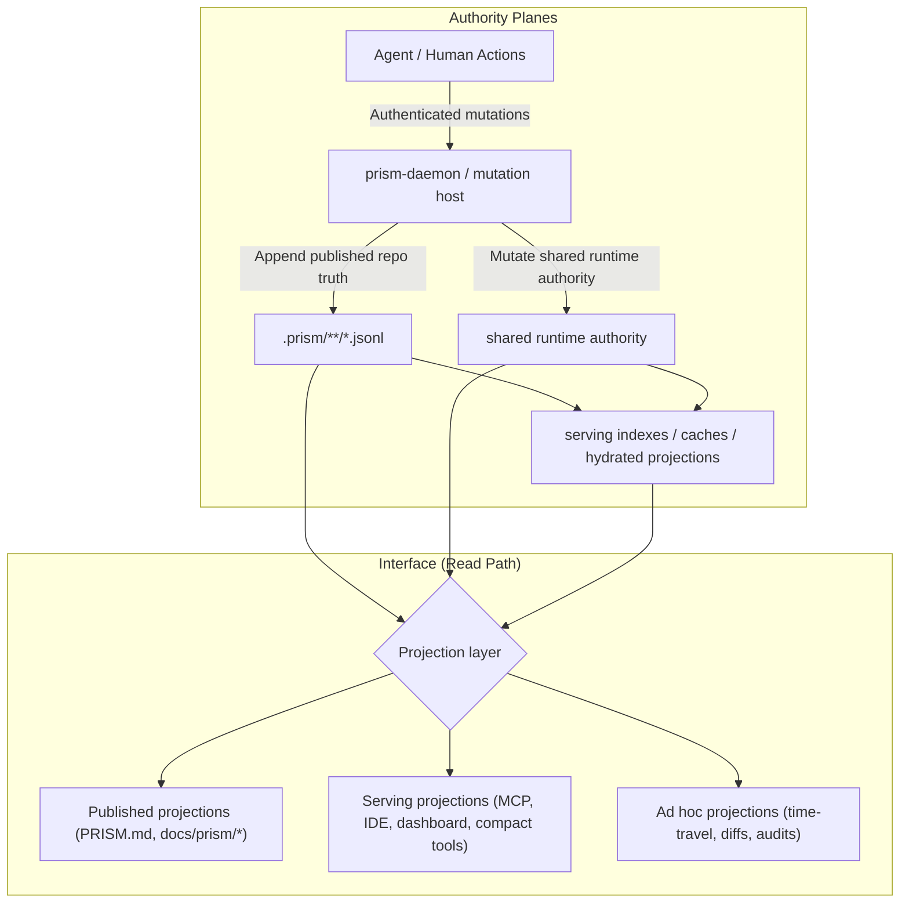

# PRISM Projections: The Read Model and Interface Layer

## Status

Normative design target for the projection implementation phase.

This document is not just background rationale. It defines the architecture contract for how
PRISM separates authority from interface-layer read models.

## Normative Invariants

The following rules are implementation requirements:

1. Published repo authority, shared runtime authority, and derived projection state remain
   explicitly distinct planes.
2. Projections are always derived. They may explain, summarize, cache, hydrate, or index
   authoritative state, but they do not silently become a second write authority.
3. Projection surfaces must be able to say which authority plane or planes they read from.
4. Projection surfaces must expose freshness or materialization state when that state affects
   trust in the answer.
5. Missing, stale, deferred, or partially materialized projections must degrade honestly rather
   than presenting themselves as fully current authority.
6. Published projection artifacts such as repo-facing markdown views are deterministic
   materializations over published authority, not hand-authored canonical truth.
7. Ad hoc historical or diff-oriented views are projection requests over authoritative state, not
   a special separate database model.

## The Problem: Authoritative Truth Is Not a Usable Interface

PRISM already treats append-only event logs under `.prism/**/*.jsonl` as the published
source of truth for repo-scoped knowledge. Those logs are optimized for:

1. Immutability and provenance
2. Cold-clone replay
3. Machine validation against strict schemas

That is the right write model, but it is the wrong human interface.

A human should not need to inspect raw event envelopes to understand:

- what the active plan is
- which guarantees are currently published
- what changed over time
- what an agent is trying to do right now

Reading the ledger directly should feel like reading Git objects directly: possible, but not the
default way anyone should operate.

## The Core Idea

PRISM should treat **projections** as the read path over authoritative event-sourced state.

A projection is a deterministic derived view:

`f(authoritative events, runtime state, query inputs) -> read model`

The important constraint is that projections do not become a second authored authority.
They explain, summarize, index, and serve the underlying state.

## CQRS, But Stated Precisely

PRISM already has the beginnings of a CQRS split:

- the write path records authoritative authored state and durable outcomes
- the read path materializes indexes, summaries, packets, and UI-facing views

This document proposes making that split explicit and first-class.

The design rule is:

1. Authoritative state lives in explicit authority planes already defined by PRISM contracts.
2. Those authority planes include published repo truth and shared runtime authority.
3. Serving projections, caches, and hydrated indexes are read-optimized derived state.
4. Human-facing docs, IDE widgets, dashboards, and audit outputs are projections over the authority planes.

## Authority Planes

PRISM should say this directly instead of flattening everything into “the ledger”:

### 1. Published Repo Authority

This is the repo-scoped, append-only, replayable truth committed under `.prism/**/*`.

Examples:

- published concepts
- published concept relations
- published contracts
- published repo memory
- published plan logs

### 2. Shared Runtime Authority

This is authoritative mutable state that exists within the runtime plane rather than the repo plane.

Examples:

- principal registry and trust state
- task and claim leases
- coordination continuity
- mutable execution overlays
- unpublished working state

This is not “just cache.” It is authoritative within its own scope and lifecycle.

### 3. Derived Serving State

This is read-optimized state built from one or more authority planes.

Examples:

- cached indexes
- hydrated packets
- bounded serving overlays
- search accelerators
- precomputed query-side summaries

This state may be persisted for performance, but it must remain explicitly derived.

## Projection Classes

PRISM should distinguish three different kinds of projections instead of treating them as one blob.

### 1. Published Projections

These are committed, reproducible artifacts that make repo knowledge legible to humans.

Current examples already exist:

- `PRISM.md`
- `docs/prism/concepts.md`
- `docs/prism/relations.md`
- `docs/prism/contracts.md`

Properties:

- derived from published PRISM knowledge
- safe to regenerate deterministically
- committed because they are useful repo-facing documentation
- not themselves authored truth

These are documentation artifacts, not ephemeral cache entries.

### 2. Serving Projections

These are runtime read models used to answer queries quickly and power product surfaces.

Examples:

- compact tool result shaping
- concept packets
- contract packets
- intent and coordination overlays
- IDE sidebar payloads
- dashboard read models

Properties:

- optimized for latency and bounded serving
- may be cached, indexed, or incrementally maintained
- disposable in principle, but often persisted as accelerators
- must be refreshable from authoritative state

These should be described as serving state, not as “the truth.”

### 3. Ad Hoc Projections

These are query-time renderings for a specific question or time window.

Examples:

- “show me this plan as of yesterday at 15:00”
- “diff the last four hours of coordination activity”
- “show what the agent knew when it made this decision”

Properties:

- often parameterized by time, scope, principal, or target
- may be produced on demand
- may reuse serving projections or replay directly from the ledger
- do not need to be persisted unless profiling proves it is worth it

## Architectural Rule

Projection code must preserve a clean authority boundary:

- explicit authority planes define what is true
- projections define how that truth is made legible and queryable

That means:

- projections never silently author new truth
- derived serving storage is allowed as an optimization, not as a hidden authority
- stale or missing projections should surface freshness state rather than corrupting the authority model
- projections may read from repo authority, runtime authority, or both
- projections must not smuggle serving state back in as undeclared authority

## Time-Travel: Valuable, But Not Free

Event-sourced projections make time-travel *possible by construction*, but not operationally free.

PRISM still has to choose:

- replay boundaries
- checkpoint strategy
- retention policy
- freshness semantics
- latency budgets for on-demand historical views

So the right claim is not “time-travel comes for free.” The right claim is:

PRISM’s event-sourced authority model makes time-scoped read models natural and defensible.

That is a major design advantage, but it still requires deliberate implementation.

## Architecture



## What This Means in Practice

### Published Projections: Living Docs

The repo should continue generating concise and expanded markdown views from published PRISM
knowledge so a reviewer can browse architecture, contracts, and relations directly in GitHub.

This is already the pattern used by:

- `PRISM.md`
- `docs/prism/*`

The key design stance is that these files are committed projections of published knowledge, not
hand-authored canonical specs.

Every generated materialization should carry source metadata such as:

- projection version
- source heads or source generations
- generation timestamp

That makes generated docs and audit artifacts easier to trust and debug.

### Serving Projections: IDE and MCP Surfaces

PRISM should expose a stable read layer for tools that need bounded, structured answers.

Examples:

- “What is the active intent for this task?”
- “Which files changed under that intent?”
- “Which contract governs this surface?”
- “What validations are implied by this edit?”

These should be served from projection-oriented read models where possible, with explicit freshness
and authority semantics.

### Ad Hoc Projections: Historical and Audit Views

PRISM should support point-in-time and diff-oriented observability for plans, coordination state,
and agent activity.

Example CLI shape:

```bash
# View the plan as it existed yesterday
prism project plan:01kn6rkat --at="2026-04-01T14:00:00"

# Diff the last 4 hours of plan state
prism project plan:01kn6rkat --diff="now-4h..now"
```

Those commands should be understood as projection requests, not as special access to a separate
historical database.

## Non-Goals

This projection layer should not:

- replace the underlying authority model
- hide freshness problems behind apparently authoritative stale views
- treat cached runtime state as authored truth
- require every projection to be committed or persisted
- imply that every time-travel query must be cheap

## Why This Matters

Without explicit projections, PRISM risks having excellent provenance and weak usability.

With explicit projections, PRISM can present:

- repo-facing human documentation
- low-latency tool-facing read models
- historical observability and audits

without collapsing those concerns back into the write path.

Just as importantly, this only works if PRISM keeps three layers separate:

- explicit repo authority
- explicit runtime authority
- derived serving state and interface projections

## Ecosystem Implication

This is the right platform boundary for PRISM.

PRISM does not need to build every UI. It needs to define:

- authoritative event-sourced state
- projection contracts and freshness semantics
- stable read surfaces for humans and tools

Once that exists, IDE integrations, dashboards, CI annotations, audits, and external observers can
build on the projection layer without inventing their own interpretation of the ledger.

## Recommended Positioning

The shortest accurate summary is:

> PRISM’s ledger is the authority layer. Projections are the human and tool interface layer.
> Some projections are published docs, some are runtime serving indexes, and some are ad hoc
> historical views. They may read from published repo authority or shared runtime authority, but
> all of them remain derived and none of them silently replace the underlying truth.
